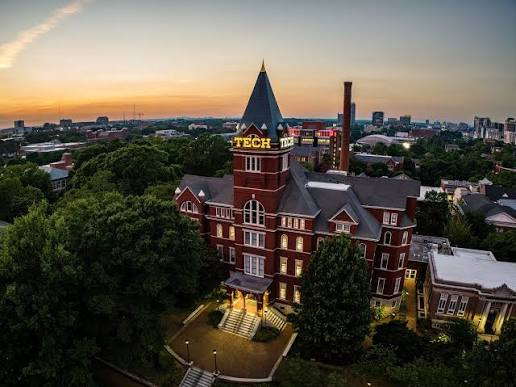



My name is Aneesha Guna and I am originally from Melbourne, Florida. I am a US citizen and have an active secret security clearance. I am a second-year student at Georgia Tech studying computer science (Intelligence and Devices threads) with a minor in robotics, expecting to graduate in Fall 2028. I hope to get my Masters in robotics or a related field for computer science. I am interested in the fields of aerospace, research, robotics, autonomous systems, and computer vision.

 