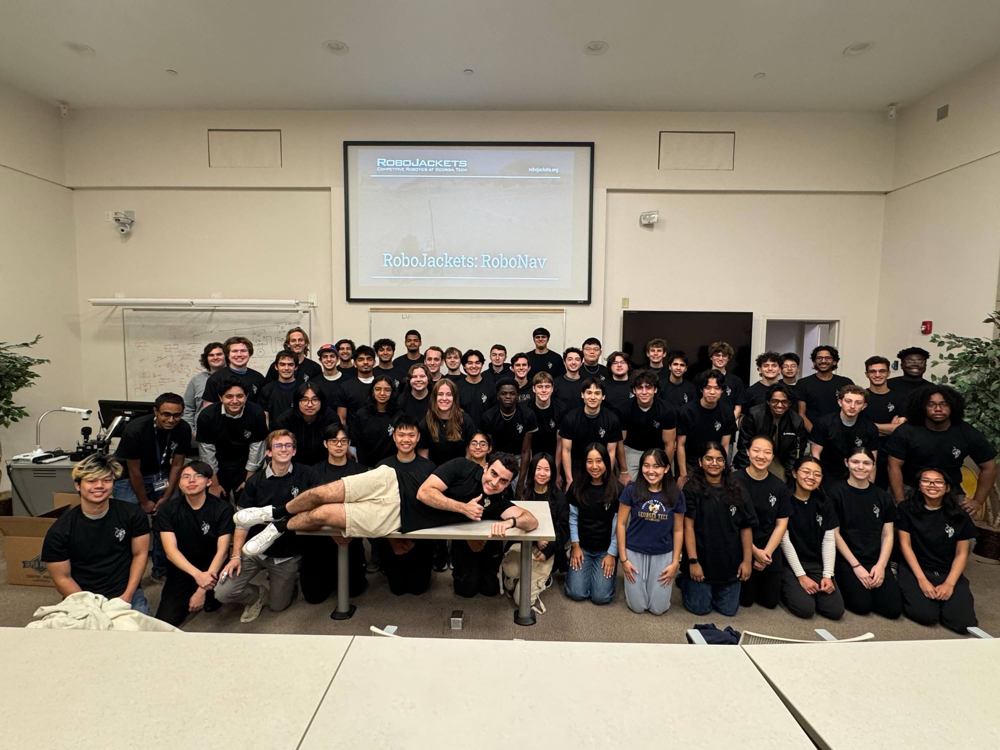
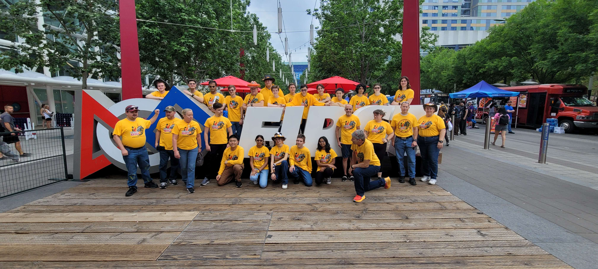


## Agile Locomotion & Manipulation VIP Team
Part of the Quadrupedal Navigation subteam since January 2026 working on real-time robotic navigation on uneven ground
  * Created a simulation for a humanoid robot walking through rough terrain in ROS2
  * Migrated code from ROS1 to ROS2 and updated the robot’s motion information from quadruped to humanoid
  * Worked alongside graduate student Max Assemelier to test code on the physical robot
  * [LiDAR Lab Link](https://lab-idar.gatech.edu/)
  * [Agile Locomotion & Manipulation VIP Link](https://vip.gatech.edu/teams/entry/1281/)
  * [Publicly Available GitHub Link](https://github.com/orgs/GTLIDAR/repositories)

## RoboJackets
Part of the RoboNav Software team since August 2025 working to plan, model, build, and code a robot similar to a Mars rover that can compete in the University Rover Challenge competition
  * Modeled ArUco tags using CAD to mimic the standards used in the University Rover Challenge competition
  * Automated the robot’s camera to detect the type and position of ArUco tags in a ROS2 Gazebo simulation
 * [URC Competition Link](https://urc.marssociety.org/home/about-urc)
 * [GitHub Link](https://github.com/RoboJackets/urc-software)
 * [RoboNav Team Link](https://robojackets.org/teams/robonav/)
 

## FIRST Robotics (FTC + FLL) Volunteering
  * Led outreach sessions introducing elementary students to robotics programming, sparking early interest in STEM
  * Conducted STEM workshops for middle school students, emphasizing problem solving and hands-on learning

## FRC Robotics 801 Horsepower
  * Led the programming team for two years, contributing to multiple awards and regional championships
  * Recognized as a Dean’s List Semifinalist nominee and award recipient for outstanding leadership, academic excellence, and impact within the team
  * [GitHub Link](https://github.com/Team801Horsepower)
  * [News Article](https://spacecoastdaily.com/2025/05/first-robotics-team-801-horsepower-thanks-sponsor-all-points-after-outstanding-performance-at-world-championship/)
 

## Future Problem Solvers Club
* Led instruction on the 6-step competition process to peers as a student leader
* Increased club membership by 100% and supported all teams in qualifying for the state competition for the first time
* Evaluated competition booklets in the district and state elementary competitions
* Advanced to and competed in the team category at the International Conference for the past four years
* [Competition Link](https://futureproblemsolving.org/florida/)

## Brevard Surfing Special Olympics
* Volunteered with the Special Olympics to teach children how to surf and prepare for competitive events
* Assisted in organizing and coordinating various activities at Special Olympics competitions
 

## MATHCOUNTS
 * Served as club president, doubling membership and guiding the team to qualify for the state-level competition
 * Mentored middle school students in applying mathematical concepts to prepare for the MATHCOUNTS competition
 * Volunteered at the district MATHCOUNTS competition, assisting with event organization and logistics
* [Competition Link](https://www.mathcounts.org/)

## Tutoring
* Tutored students in Math, Spanish, and Chemistry through NHS, Spanish Honors Society, and Mu Alpha Theta empowering my peers through education

## Tamil School
* Graduated from International Tamil Academy in May 2022 after completing all levels of the program
* Can read, write and speak the language
* Tutored young children in both spoken and written Tamil