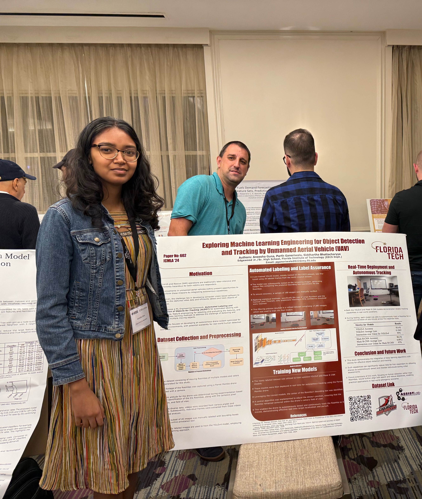



## Teaching Assistant
Georgia Tech CS 1301 TA - Aug 2026 – Present
  * Will work as a TA, conducting office hours and recitations, helping students with their questions, homework, and labs

<!-- &nbsp; -->

## Kalacharis
Software Engineer - May 2026 – Present
  * Created a website for a startup company to showcase multiple vendors selling Indian clothing, jewelery, and other related items
  * Programmed the application so that users can search for items for a particular theme, color, price range, and/or occasion
  * [Website Link](https://kalacharis-ensemble-newest.vercel.app)
<!--    -->

## Northrop Grumman
Software Engineering Intern - May 2026 – Jul 2026
  * Benchmarked a proprietary Java application across multiple JVMs to balance resource efficiency and performance
  * Improved the functionality of the JVM with the least resource requirements to deploy on a resource-limited drone
  * Created programs to convert formats of positional and object information for cross-client communication

## RoboTech Hackathon 2026
Competitor and Team Member - Jan 2026
  * Programmed a System Technology Works humanoid robot to detect human faces and objects and respond to visual input and voice commands
  * Developed a web application to visualize robot data and presented it to judges, earning 5th place in the autonomous track
  * [DevPost Link](https://devpost.com/software/nebula-astronaut-s-best-friend)

## AI ATL 2025
Competitor and Team Member - Nov 2025
  * Developed a web application to record users' speech/presentation and give back a score and feedback
  * Used Google Gemini in the application to analyze the speech and automatically give specialized feedbak regarding the speech pattern, overall writing, and spoken filler words
  * [DevPost Link](https://devpost.com/software/speakify-w7tsme)

## HackGT 12
Competitor and Team Member - Sept 2025
* Programmed a logic algorithm for a mobile app that assigns specific roles to team members looking to create specific projects for a hackathon
* Used Mastra.ai to integrate AI models into the app, automatically generating prompts to obtain a detailed workflow for each team member based on the generic project details entered by users

## Brevard Zoo + COASTech
Researcher and Intern - Jun 2024 – May 2025 
  * Applied machine learning models in MATLAB to analyze aerial drone imagery for the detection of North Atlantic right whales in marine environments
  * Enhanced image detection accuracy from a baseline of 87% to 95.4%, surpassing previously published results through model optimization and refinement
  * Volunteered at Science Sunday events to present my research and findings to the community
  * [News Article Link](https://erau.edu/about/news-and-stories/news/eagles-use-drones-to-support-stem-education-wildlife-our-environment)

## IEEE Xplore + ICMLA ‘24
Researcher, Presenter, and Main Author - May 2022 – Dec 2024
  * Built and deployed a UAV-based ML pipeline for real-time object detection and tracking, achieving 96% accuracy and 0.1942 loss using YOLOv4 and Mask R-CNN
  * Research focused on assurance methods in autonomous UAV perception systems using advanced machine learning was presented and published at an IEEE conference
  * Wrote and presented a research paper at the ICMLA ’24 conference on these findings
  * [Research Paper Link](https://ieeexplore.ieee.org/document/10903281)
  <!-- * [Dataset Link](https://github.com/ParthGaneriwala/RoombaDataset) -->
 