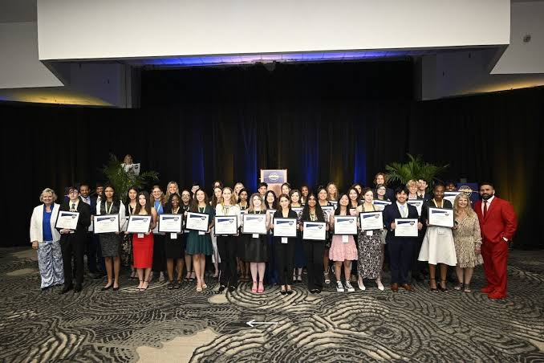



## [Georgia Tech Faculty Honors](https://meritpages.com/Aneesha-Guna/9833330)
* May 2026 and December 2025
* received through a 4.0 academic average

## [Georgia Tech Steve & Lynne Bussey Scholarship](https://spacecoastgatechclub.org/bussey.html)
* May 2025

## [Brevard Schools Foundation Scholarships: Laurie Ann Sargeant Scholarship for Science Research + Imagine Believe Realize Futures in Technology](https://brevardschoolsfoundation.org/programs/scholarships)
* May 2025

## [National Merit Corporate Northrop Grumman Scholarship](https://www.nationalmerit.org/s/1758/start.aspx?gid=2&pgid=61)
* April 2025

## [Sunshine State Scholar 2024](https://www.fldoe.org/newsroom/latest-news/the-florida-department-of-education-honors-top-stem-students-at-2024-sunshine-state-scholars-conference.stml)
* Awarded a one-year scholarship to a Florida public university, selected as one of 37 students statewide to receive this prestigious honor. Recognized as one of two top 11th-grade STEM students in the region.
* May 2024  \
 

## FRC Dean’s List semi-finalist award
* February 2024
* Awarded for outstanding leadership, academic excellence, and impact within the team