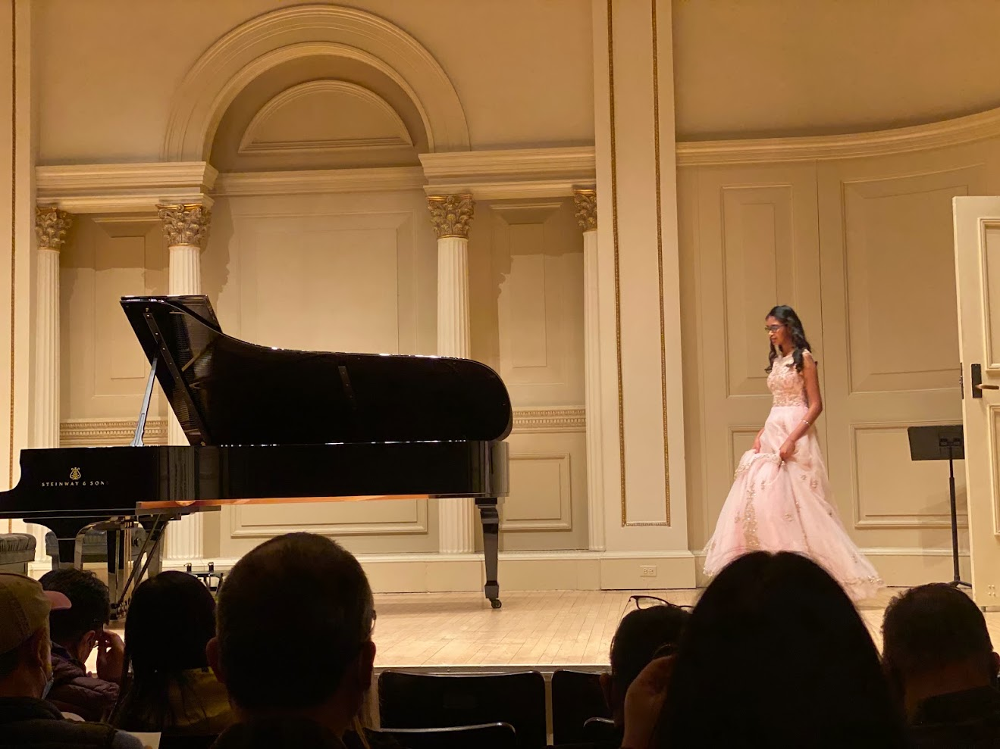
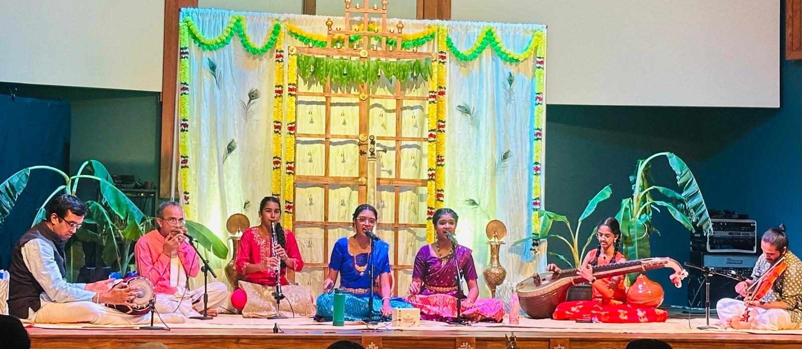



### Fine Arts:
## Piano
* Played for 13 years and competed in multiple competitions
* Earned superior (highest) ratings in the National Federation of Music Clubs Festival
* Placed 3rd & 2nd in the Florida Keys International piano competitions and played at prestigious Carnegie Hall, NY as a result
picture!!!

## Carnatic Music
* Sang carnatic music for 11 years at concerts both solo and as a group
* Sang at a "final" recital called Arangetram with an orchestra, in front of nearly 200 attendees
picture!!!

## Violin/Orchestra
* Played for 6 years, serving as concertmaster and 2nd violin section leader at my school's orchestra
* Received scores of superior (highest) ratings in Solo & Ensemble and MPA
picture!!!

### Languages:
Fluent in English
Fluent in Tamil
Working proficiency in Spanish
